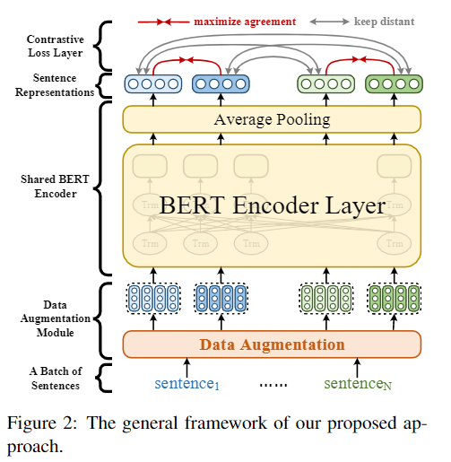
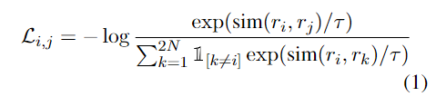

### 对比学习 自监督 句子表征
#### ConSERT: A Contrastive Framework for Self-Supervised Sentence Representation Transfer - 北邮, 美团
##### Abstract
&emsp;&emsp; 本文提出ConSERT, 利用对比学习对BERT进行无监督微调, 通过使用无监督数据, ConSERT解决了BERT句子表征崩溃问题, 在无监督训练时, 效果可以与SBERT-NLI相比, 在使用NLI有监督后, 效果达到sota.  此外, ConSERT对于数据稀缺性表现优异, 当只有1000个训练样本时仍然能够获得优秀的结果.

##### 1. Introduction
&emsp;&emsp; 直接用BERT做STS相似度任务, 句子对的相似度集中在0.6-1.0, 尽管有些句子十分不相似, 这种现象被称为崩溃(collapsed), 即所有的句子嵌入都被投影到一个很小的区域, 因此他们具有较高的相似度.  其次, BERT的句子嵌入具有各向异性的问题, 高频词汇聚在一起靠近原点, 当平均每一个token的嵌入后, 高频词的向量嵌入主导了整个句子表征, 引入了偏置, 致使句子不能表达其原本的语义.
&emsp;&emsp; 为了减缓这一问题, 本文提出了对比学习目标. 本文尝试了不同种类的数据增强手段, 包括adversarial attack, token shuffling, cutoff, dropout等.  相较于之前的方法, ConSERT的优点在于: 1. 没有引入额外的结构. 也会就是说ConSERT的参数数量和BERT是一样的, 方便使用. 2. 仅需要少量的训练数据, 便可以得到一个不错的结果(1000条). 3. 对不同种类的数据增强手段进行了消融分析.

##### 2. Related Work
###### 2.1 Sentence Representation Learning
1. Supervised: 使用NLI数据进行有监督训练, 例如USE, InferSent, SBERT.
2. Self-Supervised Objectives for Pre-training: 使用不同种类的自监督目标进行预训练, 类似于BERT的MLM, NSP.
3. Unsupervised: BERT-flow, 将BERT的嵌入投映射到标准高斯分布, 但这种方法引入额外的结构, 不方便应用.(大家都想直接.from_pretraind直接用, 而不是去你的github下载你的代码)
###### 2.2 Contrastive Learning
1. Contra for CV: SimCLR, 使用标准化温度缩放交叉熵作为损失.
2. Contra for NLP: IS-BERT在BERT的外层加入1D Conv, 来最大化全局表征和局部表征之间的互信息. CERT, 使用机器翻译作为数据增强. BERT-CT, 使用两个独立编码器来做对比学习, 但是需要额外内存开销. DeCLUTR, 采用SimCLR的结构, 联合MLM和对比学习目标对模型进行训练, 并且属于预训练, 需要大量语料库.

##### 3. Approach
###### 3.1General Framework
&emsp;&emsp; 本文的方法首SimCLR启发, 整体框架如下图. 框架一共柏寒三个部分: 1. token embedding layers处的数据增强模组. 2. 共享的BERT encoder来获取句子表征, 本文使用BERT最后一层隐状态的mean pooling作为句子表征. 3.在BERT encoder之上的对比损失层. (图画的很丑)

&emsp;&emsp; 效仿SimCLR, 使用温度缩放的归一化交叉熵损失作为对比学习目标,  每次采样大小为N的mini-batch, 对每个数据进行一次数据增强得到2个向量表示,  损失函数也是老熟人了.

###### 3.2 Data Augmentation
采取了不同的数据增强手段, 包括对抗攻击, token打乱, 裁剪, dropout.
1. Adversarial Attack: 对抗训练的最初目的是为了而增强模型的健壮性, 通过在样本中加入最差的扰动来生成对抗样本. 本文使用Fast Gradient Value策略来找到最差扰动. 值得注意的是, 只有在有监督情况下才可以使用FGV, 因为FGV是根据监督学习的损失来计算对抗扰动的.
2. Cutoff: token cutoff, 随机删掉一些token. feature cutoff, 随机删除一些特征维度. span cutoff, 随机删掉一个跨度里的tokens. 本文使用token cutoff和feature cutoff
3. Dropout
###### 3.3 Supervision Signal

&emsp;&emsp; 本文除了可以使用无监督, 同样可以使用有监督, 以NLI为例. 有监督训练的方式也很和过去的方法一样. 使用三种方法融合有监督信号.
- Joint training: 在NLI数据集上同时训练对比损失和分类损失
- Supervised training then unsup transfer: 首先在NLI数据集上用对分类损失训练, 之后再目标数据集上用对比损失finetune.
- Joint training then unsup transfer: 首先再NLI数据集上联合训练, 之后再NLI数据集上用对比损失finetune.
$$
\large f = Concat(r_1, r_2, |r_1 - r_2|) \\
\large \mathcal L_{cc} = CE(Wf + b, y)
$$

##### 4. Experiment
有监督情况下使用SNLI+MNLI, 再联合训练中, NLI也参与对比学习的训练.

这篇文章和SimCSE是同期文章, 但是效果没有SimCSE好, 他们二者也差不多 懒得看了.