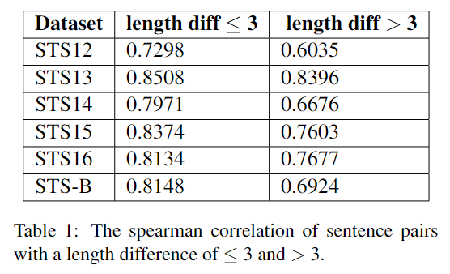
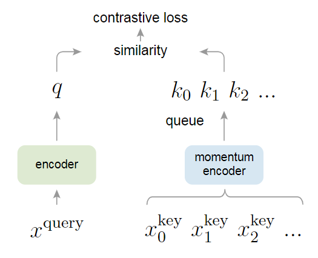
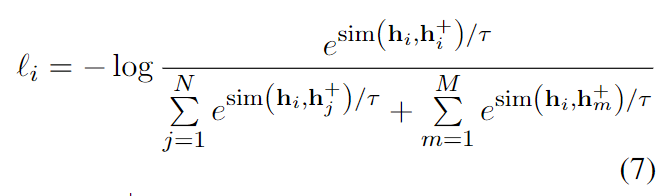
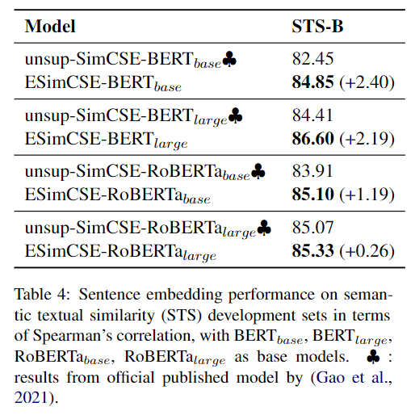
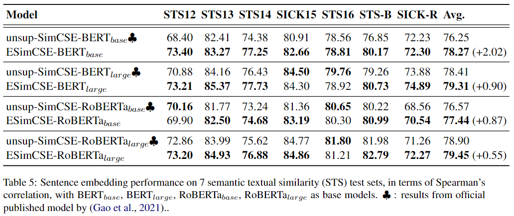
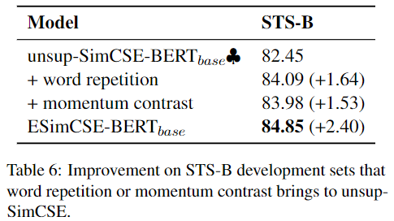
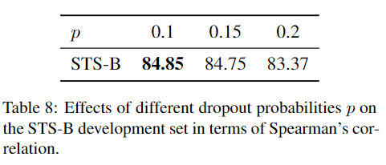
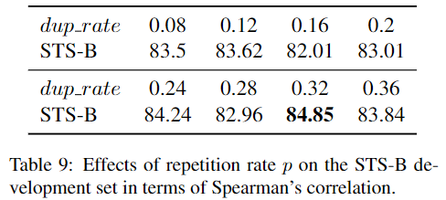

#### ESimCSE: Enhanced Sample Building Method for Contrastive Learning of Unsupervised Sentence Embedding
##### Abstract
&emsp;&emsp; **由于Transformer模型具有位置编码**, 而无监督SimCSE是通过dropout来构建正例句子对的, 因此**无监督SimCSe生成的正例句子和原本的句子长度是相同的**, 这就有可能给模型**带来偏差**, 模型可能会倾向于关注句子长度的信息. 通过统计观察, 发现无监督SimCSE确实存在这个问题.  为了解决这个问题, 本文将句子中某个单词复制一遍得到正例,并提出了**momentum contrast**, 使用一个队列维护先前batch中模型输出,  来拓展损失计算中的负例对, 来更充分地比较.

##### 1. Introduction
&emsp;**&emsp; 句子对长度的差异对评估结果的影响十分大**: 上文提到的, 句子长度带来的偏差是否真是存在? 作者进行了实验, 将句子对长度差异按照阈值3分为两组, 发现相似度在3这一点有着断崖式的下降. (作者实验不全, 差距大也可能是因为和句子长度有关 , 没有对比其他模型例如S-BERT)

&emsp;&emsp; 为了解决这个问题, 希望能够改变正例对中句子的长度但不改变其语义信息. 现有的改变句子长度的数据增强手段常见的有单词插入和删除, 但是由于这两种操作的随机性, 可能会对原本句子的语义产生较大的变动. **因此本文提出了一种更加保险的方法, 将句子中的若干个单词复制若干次**.
&emsp;&emsp; 除了优化正例对的构造, 本文也探索了更好地构建反例对. *SimCSE中证明, 扩大Batchsize并不总是能提高模型的性能*. 因此本文希望找到有效扩展负样例对的方法, 作者这里使用Momentum contrast. **它可以维护一个队列, 该队列中保存着之前batch的encoder embedding**, 并用它来**扩展负例对**.  因为入队的句子嵌入来自于之前的batch, 要维护一个用它的参数移动平均更新的模动量模型. 在使用momentum encoder时关闭dropout, 减少训练和预测之间的gap. 

>关于momentum contrast, 来自于文章MoCo, 动态维护一个队列来存储负样本, 队列里的样本不参与梯度回传, 所以可以存储很多负样本, 相当于加大了batch_size.  在momentum contrast之中对anchor和augmentations分别使用不同的编码器, 对于augmentations使用动量编码器, 使用anchor编码器的参数来更新动量编码器的参数, 这样做的目的是为了让两个编码器相似, 使队列中的内容都是由相似编码器得到的, 这样可以保持负样例特征的一致性. 下图为MoCo框架.

&emsp;&emsp; 结合word repetition, 动量编码器, momentum contrast以及无监督对比学习, ESimCSE的整体模型架构图如下.

##### 2. Background: Unsup SimCSE

##### 3. Enhanced SimCSE
###### 3.1 Word Repetition
&emsp;&emsp; 随机的将句子中的若干个word或sub-word(使用tokenizer分词得到的结果), 假设句子分词后序列$x$的长度为$N$, 复制次数为如下公式. 其中$dup\_rate$为超参数, 复制的token个数会在该区间内**按照均匀分布随机采样**. 选取$dup\_len$个单词, 将他们复制一次, 得到序列$x^+$. 之后的处理和unsup-SimCSE稍有不同, ESimCSE将$x$和$x^+$分别送入Encoder两次, 得到anchor和positive.
$$
\large dup\_len  \in [0, max(2, int(dup\_rate * N))]
$$

###### 3.2 Momentum Contrast
&emsp;&emsp; 维护一个固定长度的队列, 其中保存着之前若干个mini-batch中的sentence-embedding(detach, 不参与梯度反向传播), 每当当前小批量的句子嵌入入队, 若队列已满,  队列中最早的句子嵌入便出队.
**对于进入队列的句子, 使用动量更新编码器.** Why?

1. **为什么使用队列**? <u>为了加大反例的数目</u>, 如果不使用队列, 则反例的数目是和小批量大小相关的, 使用了队列可以让反例的数目不受小批量大小的限制. 
2. **为什么使用动量编码器**? <u>编码器每一个step都在更新, 会引入不一致性</u>. 如果使用同一个编码器$E$来对anchor和augmentation进行编码, 由于该编码器会随着每一个step不断地更新, 导致队列中不同time step的句子编码差异很大, 不一致性高, 会影响对比学习的结果. (将momentum设置为很大的数, 会有很好的效果, 也就是说每次只更新编码器的一点点参数) 初始化时, 两个编码器使用相同的参数. 

&emsp;&emsp; 将主编码器的参数记作$\theta_m$, 动量编码器的参数记作$\theta_e$, 动量编码器的参数更新如下, 其中$\lambda$是超参数, 通常取较大的数, 例如0.999. **注意**: 只有主编码器的参数是通过反向传播更新的. 动量编码器不参与反向传播.
$$
\large \theta_m \leftarrow \lambda \theta_m + (1 - \lambda) \theta_e
$$

&emsp;&emsp; 结合队列以及单词重复, ESimCSE的损失函数可以写为下公式. **值得注意的是**, 作者**先将**当前小批量的嵌入以及队列中的嵌入同时作为反例计算损失, **之后**将当前小批量的嵌入送入队列. 

##### 4. Experiment
###### 4.1 Evaluation Setup
&emsp;&emsp; 与SimCSE相同, 使用随机抽取的一百万维基英语数据作为训练, 之后使用STS-B的dev set来选择超参数.

###### 4.2 Training Details
&emsp;&emsp; 使用BERT-uncased, RoBERTa-cased的pooler_output(CLS+MLP)作为sentence embedding, 在维基数据集上训练了1个epcoh. 具体超参数详见论文.
&emsp;&emsp; 每125个steps在STS-B的dev set进行评估, 保存最好的check point用于最终的test sets. 并且使用Subword repetition代理word repitation, 在消融实验中证明有效.

###### 4.3 Main Results
&emsp;&emsp; 在STS-B的dev set上的结果以及最终test set的结果都表明, 该方法强于unsup-SimCSE.
STS-B dev set 结果如下图:

STS test set 结果如下图: 

单词重复, 动量编码器对结果的影响 on dev set:

单词重复, 动量编码器对结果的影响 on test set:

##### 5. Ablation Study
在本章节中, 作者就<u>dropout, rep_rate, 句子长度拓展, 队列大小</u>对模型结果的影响. 所有消融实验的结果均在STS-B dev set上进行评估.
###### 5.1 Dropout Rate
&emsp;&emsp; 本文探究了[0.1, 0.15, 0.2]三个dropout rate, 实验结果表明**0.1效果最好**, 0.15接近0.1, 0.2相较于0.1低很多, 但仍然比unsup-SimCSE好, 证明该方法具有鲁棒性.

###### 5.2 Repition Rate
&emsp;&emsp; 太低的rep-rate影响太小了, 太大又会影响句子的语义, 那么多少合适呢? 作者在[0.08, 0.36]区间中以0.4的step进行实验, 结果表明**0.32时结果最好**. (不过看起来随机性很大, 结果和dup_rate之间没有一个明显的趋势, spearmanr corr只有0.426)

###### 5.3 句子长度拓展
&emsp;&emsp; 除了token重复, 作者也尝试了其他拓展句子长度的方法, 例如插入stop-words, [MASK]等. 结果表明, **subword repition效果最好.**

###### 5.4 Quene Size in Momentum Contrast
&emsp;&emsp; 队列长度影响对比损失计算过程中反例的数目. 结果表明队列长度为**2.5\*batch_size时效果最好**. 作者解释: momentum contrast引入的目的就是为了在有限batch_size下获取足够多的反例, 因此提高队列长度可以提高效果, 但是队列长度过高会导致反例之间的不一致性增强, 降低效果. (但Momentum很小, 是否可以将动量和队列长度共同进行调整, 加大队列长度的同时也加大动量, 让动量编码器更一致呢?)

##### 6. Related Work
