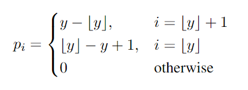
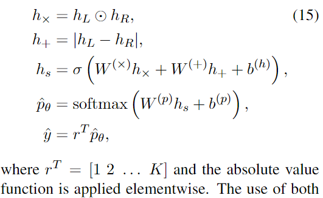
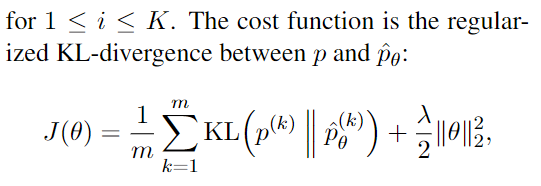

#### Improved Semantic Representations From Tree-Structured Long Short-Term Memory Networks
1. 假设STS任务的标签范围是[1, K], K为整数, 打分为该区间内的实数. 首先要对数据的标签进行编码, 将标签编码为K维度的向量. 例如K=5, 3.35将转化为向量[0, 0, 0.65, 0.35, 0].

2. 将句子对分别送入编码器得到两个句子的向量表征, 之后对两个向量做乘法变化和**加法**变化, 送入到**线性分类器+softmax**得到最终的预测**概率分布**$\hat{p_\theta}$. 之后使用概率分布和arange(1, K)内积得到预测相似度$\hat{y}$.

3. 为了让通过预测概率分布$\hat{p_\theta}$得到的**预测相似度$\hat{y}$和标签$y$尽可能地相似**, 使用**KL-DIV**来对**预测概率分布$\hat{p_\theta}$和通过标签得到的概率分布$p$**进行优化.  当然这里也可以使用概率分布之间的**MSELoss**进行优化. (SentEval中使用的是EMSELoss, 论文原文中使用的是KL-DIV). 

如果使用MSE-LOSS:
$$
\large J(\theta) = \frac{1}{m} \sum_{k=1}^{m} (p^{(k)} - \hat{p}_\theta^{(k)})^2 + l_2reg
$$

4. 之后就可以使用$\hat{p_\theta} \  dot \  [1..K]$得到预测相似度打分, 来计算相关系数.

