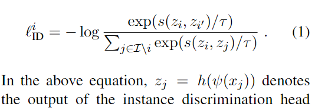
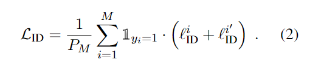
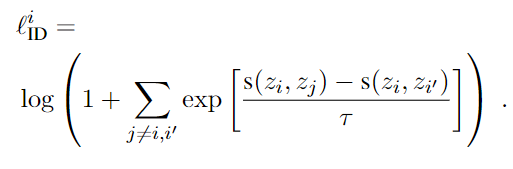
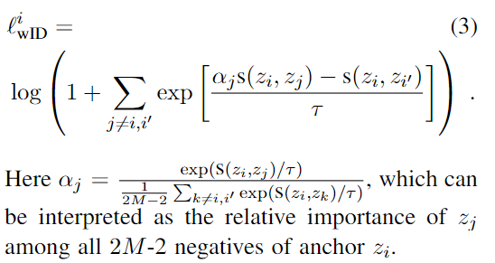
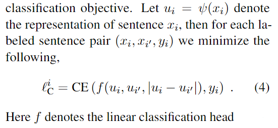
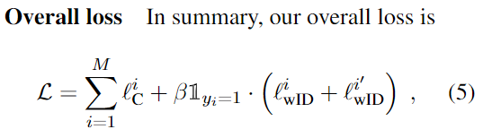
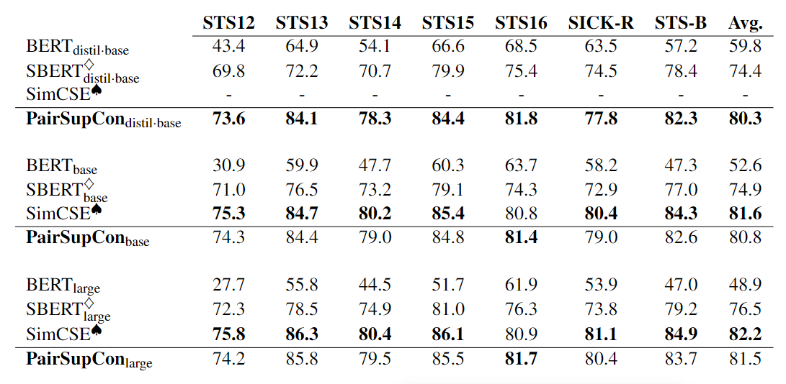
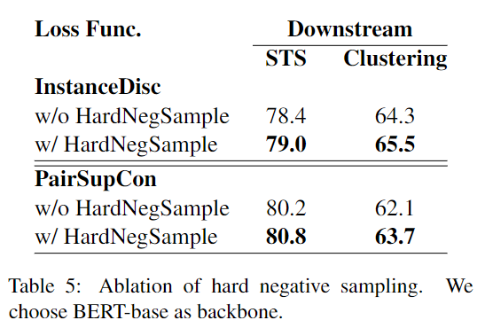
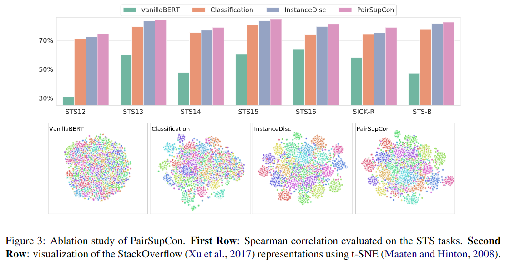

### 有监督, 对比学习, 句子表征
#### Pairwise Supervised Contra Learning of Sentences Representation - Amazon AI
##### Abstract
&emsp;&emsp; 近期成功的句子表征学习再有监督的情况下, 通常在NLI数据集上使用triplet loss或siamese loss进行微调.  他们都存在着一个问题, 就是矛盾句子对中的句子不一定是来自于同一个语义范畴的, 因此仅仅优化蕴含和矛盾是不足以捕获高级语义结构的.(讲故事) 使用NLI有监督训练的缺点是, 他们只考虑了单个句子对, 收到局部最优的影响. 本文提出了**PairSupCom**, 基于实例判别的方法, 希望将通过高层次范畴的概念编码将语义蕴含, 矛盾联系起来. 

&emsp;**&emsp; 一句话概况**: 这篇文章**借鉴了**使用NLI Siamese训练和对比训练, 将**NLI训练删除neutral样本作为二分类任务**; 将**对比损失聚焦于entailment对**中, 并**施加注意力机制**来获取强反例. 

##### 1. Introduction
&emsp;&emsp; 介绍NLI数据集, 本文与SentenceBert进行对比. 本文收到自监督学习的启发, 提出了实例鉴别损失+句子对语义推理的联合优化方式. 实例鉴别学习可以在向量空间中将相似的实例隐式的分组在一起, 无需显示的学习. 现有的sota方法在STS数据集上表现出色, 但是在嵌入的categorical semantic structure(文本聚类)上会有所欠缺, 更好的捕获高级语义概念反过来可以促进因好矛盾的推理. **简而言之, 现有的sota方法在STS上性能优秀, 但是在文本聚类任务上表现变差, 作者认为折是嵌入空间产生了退化**
##### 2. Related Work
1. 通过NLI数据集学习句子表征, 例如InferSent, Universal SE, SBERT.
2. Self-Supervised Instance Discrimination: 对比学习实质上是解决了在一个mini-bathc中, 在茫茫多的negative pair中判别出positive pair.
3. Deep Metric Learning: 使用三元组损失或孪生损失, 通常需要大量的训练数据. 通常由两种解决方案, 一种解决方案是在训练数据中采样hard positive/negative, 这种方案需要大量人力; 另一种方案是在triplet loss上加入对比损失, 让正例能够对抗反例.  本文的工作结合了上述两种方法, 区别在于上述的方法需要类别层次的监督来选择负样本(聚类), **作者希望找到强反例, 这些反例比一眼就能看出来的反例更加有价值**. 但是NLI数据集中没有类别的标签, 于是使用contradict作为hard-negative需要假设hard-negative和anchor他们处于相同的语境中, 并且语义相似. 4.3中探讨了这一假设.

##### 3. Model
&emsp;&emsp;  作者使用SNLI+MNLI作为训练数据.
###### 3.1 Instance Discrimination
&emsp;&emsp; 使用NLI的*entailment*数据来优化实例判别目标，该目标送希望将正例对从其他样例之中区分开来。 其**对比损失和传统对比损失很相似, 为log-softmax形式**。一个batch的大小为M, 共有2M个句子, 其中前提和假设句子各M个, 需要从2M-2(去除自身)个句子中区分出正例对. 

&emsp;&emsp;每次采样的minibach:$D = \{(x_j, x_j^\prime), y_j\}_{j=1}^M$, 其中$y_j$ = ±1代表该句子对是*entailment*还是*contradict*. 每个正样例的损失函数如下:

&emsp;&emsp; 上述的损失希望以premise为anchor找到正确的hypothesis, 类似的, **添加一个对称的损失函数**, 希望以hypothesis为anchor找到对应的premise. 又由于上述的对比损失**只对正例对进行优化**, 因此添加一个**验证函数**. 其中$\rm P_M$为一个minibatch中*entailment pairs*的数量.

###### 3.2 Learning from Hard Negative
&emsp;&emsp; 等式(1)可以进行变形得到下式. 具体变形过程就是**通分**, 然后把-log变成log-, 就可以化简得到. 该损失可以被解释为, 将传统三元组损失中, 一个minibatch中剩余2M-2个样本看作负样本. 传统三元损失如下, 其中s代表向量嵌入. (我是没看出来这两个损失之间有什么关联?) **事实上, 直接用(1)式的损失函数, 在分母加注意力就好, 作者这么些纯纯的恶心人**

&emsp;&ems**p; 我们希望hard negative在向量空间中和anchor相似**(hard neg和anchor都在一个语义范畴内, 但他们的语义不同, 更难区分), 但是由于一个batch中的数据是随机采样的, 很难做到这一点. NLI数据不直接提供语义范畴标签, 因此需要自行找到hard neg. 
&emsp;&emsp; 作者在这里使用了类似于**注意力机制的加权方法**. 其中$\alpha_j$代表注意力权重, 和anchor越接近(越容易混淆, 越强的反例)的样例注意力权重越高.

> The assumption is that hard negatives are more likely to be those  that are located close to the anchor in the representation space

###### 3.3 Entailment and Contradiction Reasoning

&emsp;&emsp; 实例判别损失主要*让每一个正例对和其他正例对分开*, 但并*没有对蕴含和矛盾对进行显示区分.*  因此, 额外添加一个**蕴含矛盾推理目标**进行联合优化. 该训练目标是**句子对分类任务**. 作者将该分类任务从Sentence-BERT采取的三分类转化为了二分类任务, 派出了neutral, 依旧是对两个句子的特征进行了减法拼接. 

&emsp;&emsp; 最终总体损失为**所有样本上的CEloss**加上**正样本对上的注意力对比损失**, 如下图.

##### 4. Experiment
>只看STS, 不看聚类

###### 4.2 STS
&emsp;&emsp; STS任务中实验结果如下: 似乎赶不上SimCSE, 但是SimCSE在STS-benchmark上进行了训练, 而本文的方法仅在NLI上进行了训练, 作者认为存在的性能差距可能来自于训练数据的不同.

###### 4.3 Ablation
&emsp;&emsp; 作者就是否使用强反例采样进行了消融实验, 即3.2节中提到的**注意力对比损失**. 实验结果如下, 使用了强反例采样会提高表现. 

&emsp;&emsp; 作者对使用不同损失函数也做了消融实验, 对比了只是用分类损失, 只是用对比损失和二者均使用的效果. 结果表明: 分类 < 对比 < 分类+对比.

##### 5. Discussion and Conclusion
&emsp;&emsp; 作者使用了注意力机制, 来采样更强的负样例. 并且作者做出展望, 如果数据具有特定领域的知识, 能获得提升.(例如NLI数据集将不同花体, 不同语境的数据进行聚类, 即每条数据具有一个类别标签, 方便对比损失筛选强反例.)