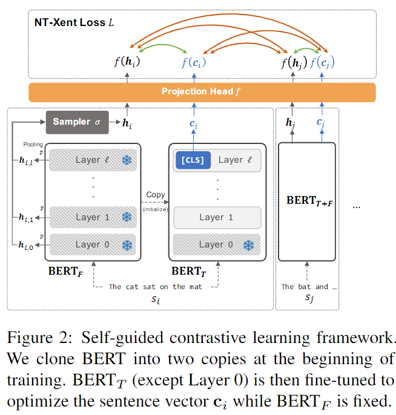
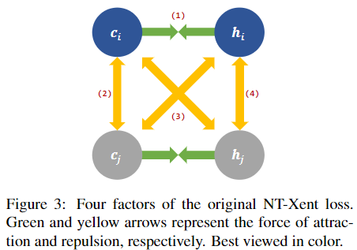
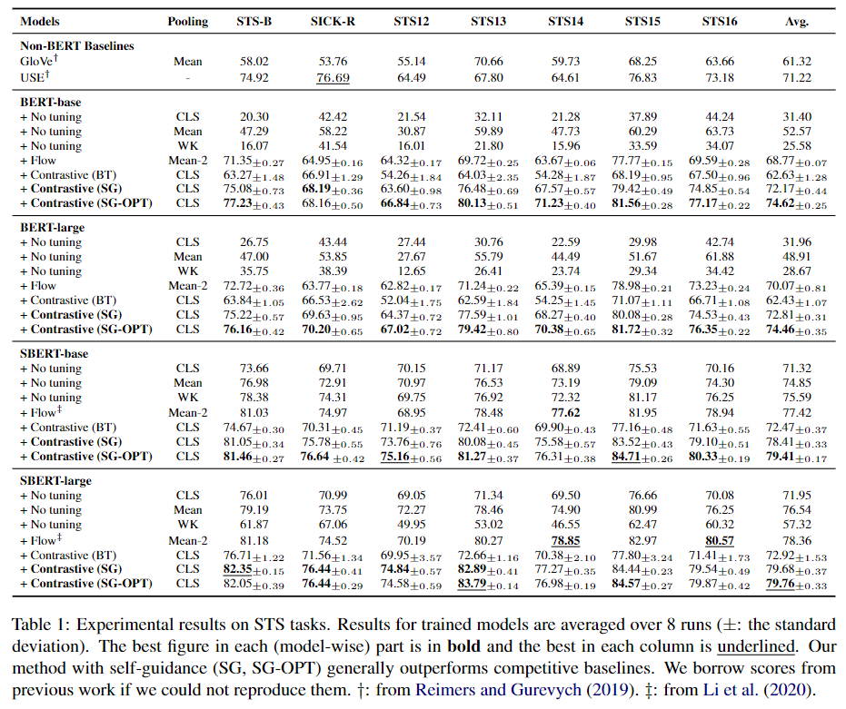
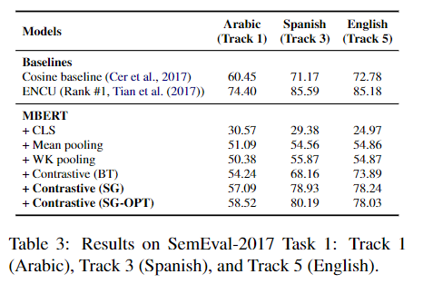
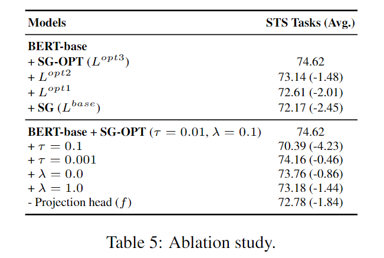

### Self-Guided Contrastive Learning for BERT Sentence Representations

###### Taeuk Kim, Kang Min Yoo, and Sang-goo Lee   $ACL 2021$

#### Abstract：  
&emsp;&emsp; BERT很强，但是如何使用BERT获得最好的句子嵌入呢？本文提出了一种**对比学习**方法，利用**自监督**的方式来提高BERT句子表征的质量。该方法使用self-supervised的方式对BERT进行fine-tune，需以来数据增强，并且可以使用[CLS] token作为句子嵌入向量。并且证明该方法具有高效率推理，并且对domain shift具有健壮性。

> （SentenceBert中提到使用[CLS]作为句子嵌入效果差，BERT-Whiting使用first-last-avg，而SimCSE则表示[CLS]和token avg效果差别不大）

#### 1. Introduction

&emsp;&emsp; 预训练Transformer推动了NLP的发展。但是他们的结果不能直接应用在句子层级的任务上，因为在预训练过程中，模型聚焦于token-level的任务，例如MLM。最典型的，使用BERT类模型作为句子编码器的方法，是在一个有监督的下游任务上进行fine-tune，例如NLI。通常使用最后一层的[CLS]作为整个句子的表示，这样做的好处在于，在fine-tune过程中，只有[CLS]在BERT和下游任务之间进行交互，帮助它捕获句子整体的信息。但是在没有监督训练数据时，如何进行fine-tune？最通常的做法是对BERT最后一层的token embedding做pooling。本文对使用使用哪些层、池化方法做了分析，在STS数据集上进行了测试，结果表明他们都很烂。

&emsp;&emsp; 该方法的核心思想是，利用BERT中间层的hidden representation作为positive samples，并且要求最终的句子嵌入应该和中间层的表示接近。本方法不适用庶几乎增强，因此比大部分其他对比学习的方法都简单，并且将CV领域NTXent loss针对BERT做了一些修改。

#### 2. Related Work

##### Contrastive Representation Learning   

&emsp; &emsp; 最早可以追溯到word2vec的负采样，之后有使用对比学习目标来训练Transformer类模型的，和本文类似。但是本文并不打算重新训练一个预训练模型，而是在现有预训练模型上进行修改。

##### Fine-tuning BERT with Supervision  
&emsp;&emsp; BERT fine-tune不总是有用，尤其是缺乏目标域的数据时。有人提出使用有监督对比学习目标作为fine-tune过程中的辅助手段。作为对比，我们来解决在没有有监督数据时，要如何完成该任务。

##### Sentence Embedding from BERT  

- SBERT：孪生网络共享参数，使用最后一层使用mean pooling而得到定长句子嵌入，在NLI数据集上进行fine-tune。

#### 3. Method

&emsp;&emsp; 类似于sbert，使用监督方式，需要大量有监督数据。对比学习，通常要使用数据增强手段，而本文的方法只需要原始的无监督数据，不需要额外数据增强，直接使用BERT中间层的隐状态。

##### 3.1 Contrastive Learning

&emsp;&emsp; 一种不需要外部数据的对比学习方法是虚拟对抗训练，但不能保证句子嵌入的语义在加入随机扰动后是否会发生改变，作为替代，使用BERT中间层的隐状态，这样能够从概念上保证两个向量的语义相似，本文称这种方法为 *self-guided contrastive learning*. 

&emsp;&emsp;本文的框架如下图所示。将BERT复制两份，一份所有层的参数固定，另一份只固定第零0层的参数（embedding layer）。目的是为了防止在训练过程中退化（两个BERT在训练过程中互相接近）这种结构可以在不引入外部额外信息的情况下，融合BERT不同层的内容。使用$BERT_T$的[CLS]作为最终的句子表征.

&emsp;&emsp; First, 在一个minibatch中给定$b$个句子$s_1,s_2....s_b$, 将每个句子送入$BERT_F$中得到token-level的hidden representation $H_{i,k} \in \R^{len(s_i) \times d} $
$$
[H_{i,0};H_{i,1};...H_{i,l}] = \rm BERT_F(s_i)
$$
&emsp;&emsp; Second, 对$H_{i,j}$使用池化操作$p$得到固定长度的向量, 最后使用采样函数$\sigma$来获得最终表示. 为了方便,本文使用max-pooling以及uniform sampler, 该sample对每一层的状态按照同等的重要性进行处理.
$$
h_{i,k} = pool(H_{i, k}) \in \R^{d} \\
h_i = \sigma(\{h_{i,k}|0\le k \le l\})
$$

&emsp;&emsp; Third, 对每个句子$s_i$送入$\rm BERT_T$计算其[CLS]向量$c_i \in \R^d$. 将一个batch中的所有向量$h_i, c_i$并入一个集合$X$. 使用[$NT-Xent$][SimCLR]作为损失. (the normalized temperature-scaled cross entropy loss). 其中$x_m$和$x_m'$, 他们分别是是第m个句子在$\rm BERT_F, BERT_T$中得到的两个向量. $sim$代表余弦相似度.

> 说直白就是在一个minibatch内,将除了一个正例和自身以外的样本都看作反例, 对他们的向量经过mlp非线性变换的结果做余弦相似度, 之后使用softmax+CEloss. 其中添加了一个温度超参数 $\tau$. 本文的公式太复杂,所以给出原文的公式.

$$
x_i = MLP(v), v\in[c, h] \\
\mathcal{L}_{m} = -log\frac{exp(sim(x_m, x_m')/\tau)}{\sum^{2b}_{n=1,n\neq m}exp(sim(x_n, x_m)/\tau)}
$$

&emsp;&emsp; Lastly, 将集合$X$中所有句子$m$都计算损失, 进行加权平均. 得到最终损失, 为了防止两个BERT之间的距离相差太大,对他们的参数加上正则化项来进行限制.
$$
\mathcal L_{reg} = ||\rm BERT_F - BERT_T||_2^2
$$

$$
\mathcal L^{base} = \frac{1}{2b}\sum_{m=1}^{2b}\mathcal L_m^{base} + \lambda \cdot L_{reg}
$$

&emsp;&emsp; 在训练结束之后, 只保留$\rm BERT_F$, 并使用他的[CLS]作为最终的句子表示.

##### 3.2 Learning Objective Optimization

&emsp;&emsp; 下图直观的表示了在使用该对比损失下, 不同向量之间相互吸引/排斥的关系. 绿色代表相互吸引, 黄色代表相互排斥.  但有研究表明,这四个关系中, 只有(1)是重要的, 其余的会损害表现. 为了适应这个改变, 对训练损失函数进行修改, 提出了三种修改版本.

1.  将更多侧重点放到$c_i$上, 因为最终我们使用的是$c_i$. 只针对$c_i$进行优化, 原始版本是对$c_i, h_i$都进行优化. 可以发现损失函数中删除了以h为中心的优化, 转变成全部以c为中心进行优化. 相当于去除了上图中(4)的依赖关系.
   $$
   \mathcal{L}_{m}^{opt1} = -log\frac{exp(sim(c_m, h_m)/\tau)}{\sum^{b}_{n=1,n\neq m}exp(sim(c_m, c_n)/\tau)
   +\sum^{b}_{n=1}exp(sim(c_m, h_n)/\tau)}
   $$

2.  在$\mathcal L_m^{opt1}$的基础上, 消除了$c_i, c_j$之间的依赖关系, 即上图中的路径(2)
   $$
   \mathcal{L}_{m}^{opt2} = -log\frac{exp(sim(c_m, h_m)/\tau)}{
   \sum^{b}_{n=1}exp(sim(c_m, h_n)/\tau)}
   $$

3.  在$\mathcal L_m^{opt2}$的基础上, 将经过sampler的$h$中替换为每一层的$h$, 来获得获得更加丰富的信息.>

   > 让[CLS]和每一层的隐状态做损失,  反例要对所有层的向量相似度进行加和.(以往使用sampler则把所有层的向量uniform应该就是平均得到最终的向量h)

   $$
   \mathcal{L}_{m, k}^{opt3} = -log\frac{exp(sim(c_m, h_{m, k})/\tau)}
   {exp(sim(c_m, h_{m, k})/\tau) +\sum^{b}_{n=1} \sum^l_{p=1, p\neq m} exp(sim(c_m, h_{n, p})/\tau)}
   $$

   $$
   \mathcal L_{final}^{opt} = \frac{1}
   {b(l+1)} \sum_{m=1}^b \sum_{p=0}^l \mathcal L_{m, p}^{opt3} 
   + \lambda \cdot \mathcal L^{reg}
   $$

#### 4. Experiment

##### 4.1 General Configuration

&emsp; &emsp; 使用BERT, MBERT. 在某些情况下使用RoBERTa和SBERT.  实验结果为八次随机平均值. 在STS-B valid进行参数搜索, 并且在剩余的模型中都使用这一套参数.

##### 4.2 STS Tasks

&emsp;&emsp; 使用[CLS]embeding的 cos作为相似度, 使用SICK-R, STS12-16, STS-b进行评估, 评估指标使用Spearman corr.

###### Baselines:

- non-Bert approachs: Glove mean embeddings, Univiersal Sentence Encoder
- Bert approachs:
  - BERT [CLS] without fine-tune
  - WK pooling: QR decomposition and tricks
  - Flow: BERT-flow, 将last-2-mean的向量空间做可逆映射到各向同性分布的高斯空间.
  - Contrastive(BT): 使用back-translation(就是使用机翻来扩充其他语种的数据集)作为数据增强来进行对比学习.

&emsp;&emsp; 本文使用STS-B数据集中的未处理文本来对BERT进行fine-tune, 与BERT-flow相同, 为了对照. 其中**SG**和**SG-OPT**分别代表使用opt1和opt3作为优化目标.

###### Results:

&emsp;&emsp; 将本文的对比学习和SBERT相结合,可以很大程度上提高表现. 和[SimCSE][SimCSE]相比, 当SimCSE采取NLI无监督的方式时结果相近, 各有优劣; 但是当SimCSE采取NLI有监督训做数据增强进行练时, 本文方法的效果会落后于SimCSE.

&emsp;&emsp; 

&emsp;&emsp; 本文也进行了跨语言的STS评估, 采取SemEval 2017 Task1, 仅在英语上进行训练, 在其余语言上进行评估, 进行跨语言迁移. 实验结果表明, 模型在这种方法上表现不强, 仅仅超过了baseline, 指标就采取对应语言数据集进行训练的in domain最佳表现相距甚远.

#### 5. Analysis

###### 5.1 Ablation Study

&emsp;&emsp; 超参数选择很影响结果, 并且本文提出的改进后的优化目标的确能够提升表现.

###### 5.2 Domain Shift

&emsp;&emsp; 根据训练数据集和测试数据集的不同, 模型的表现会产生不同. 文章测试了在STS-B以及NLI(SNLI, MNLI)数据集上进行训练,在STS-B进行测试.  相较于in-domain的结果, 本文的方法在domain shift上收到的影响较小, 全面超过Bert-flow.

###### 5.3 Visualization

&emsp;&emsp;文章就正例和反例和sentence embedding投影到二维进行可视化, 结果表明, 使用对比学习后, 正例句子在向量空间中明显对齐.

[SimCLR]: http://proceedings.mlr.press/v119/chen20j.html
[SimCSE]: https://arxiv.org/abs/2104.08821

