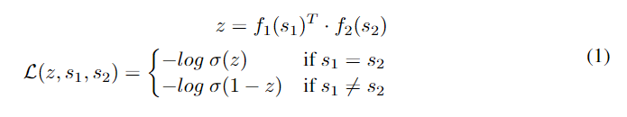
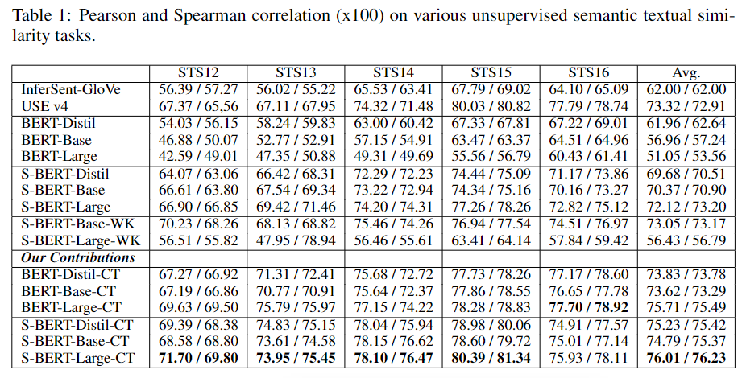
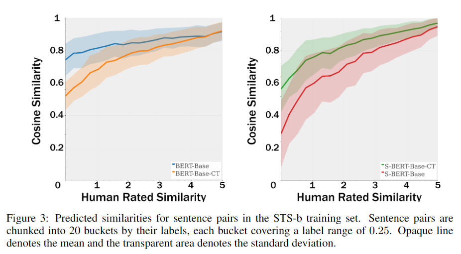

#### Semantic Re-Tuning with Contrastive Tension - RISE NLU
##### Abstract
&emsp;&emsp; 本文首次通过对Transformer预训练模型在不同层上STS相关性的调查发现, 训练目标**对模型的最后几层施加了显著的任务偏置**.  本文提出了Contrastive Tension来对抗这个偏差. CT将训练目标设定为**两个独立模型最后一层表征的噪声对比任务**.

##### 3. Layer-wise Study of Transformer Models
&emsp;&emsp; 先前的工作放下， Transformer不同层的表征性能有着先上升再下降的过程， 发现中间层的特征比较适合语言任务.  本文将所有token进行平均得到句子嵌入, 直接在STS-B的test上进行测试, 不进行训练. 
&emsp;&emsp; 作者对不同预训练模型每个层再STS-B进行评估, 发现难以找到一个通用的, 效果好的层数, 但是大多数情况下, 靠近目标函数的层表现更差.

##### 4. Method
&emsp;&emsp; 为了解决Sec3中的问题, 本文提出了*Contrastive Tension*方法, 使用**两个独立,相同初始化的模型,  最大化相同句子向量表示的内积, 最小化不同句子之间的内积.** 其中$\sigma$是logstic function

&emsp;&emsp; 随机选择一个句子, 找到K个negative句子, 得到1个正样本, K个负样本, 并且对于负样本都使用$f_2$进行编码. 这种方法是基于随机选取的句子语义不同的假设下进行的. 

##### 5. Experiments
&emsp;&emsp; 数据从English Wikipedia中采样, 为了展现模型的无监督模型和健壮性, 每个模型严格训练50000steps, 并且使用CT两个模型中较差的模型进行评估.

##### 5.2 STS bucket打分
emsp;&emsp; 作者将STS人工标注的打分按照每0.25为间隔, 统计了模型相似度和人工打分之间的关系, 实验发现SBERT的CT都能让句子对的相似度更有区分度. 并且得到了相似度和人工标签之间的对应关系, 更方便接下来再STS-b的训练集上进行回归训练.
&emsp;&emsp; 使用STS-B句子对之间的人工打分和模型给出的余弦相似度进行回归训练, 其中STS-B句子对的人工打分被缩放到去区间[M, 1], 其中M是最小的桶中句子对语言相似度的均值.

##### Appendix
1. 如果模型既在NLI目标上进行训练, 又在CT目标上进行训练, 则训练过程是先训练NLI, 后训练CT. 