### SimCSE：S1mple Contrastive Learning of Sentence Embeddings

###### Tianyu Gao, Xingcheng Yao, Danqi Chen  $EMNLP 2021$

##### Abstract：

&emsp;&emsp;本文提出了SimCSE, 一种简单的对比学习框架, 提高了当前句子嵌入的表现. 本文就监督训练和无监督训练各自提出了两种方法. 在五监督训练中, 使用dropout来构造正例; 在监督训练中, 使用NLI数据集来构造正例和反例.

##### 1. Introduction

&emsp;&emsp;本文提出的对比学习目标十分有效, 可以在预训练模型例如BERT等中使用. 本文的**无监督**目预测句子本身, 即只是用dropout作为噪音. 将一个句子送入encoder两次, 两次dropout不同得到两个不同的句子, 将这对句子作为positive pair. 其中dropout扮演最小数据增强的作用, 一旦去除dropout, 模型的表现便会急剧下滑. 本文的**有监督**目标, 借助于NLI数据集, 将entailment paris作为positive pairs, 将contradiction paris作为hard negatives.

&emsp;&emsp; [Wang and Isola][W]提出使用语义相似的正例句子对的对齐程度以及整个嵌入向量空间的均匀性来衡量嵌入的质量. 本文证明对比学习可以让句子嵌入空间的奇异值更加均匀, 增加了均匀性.  下图为对比学习框架.

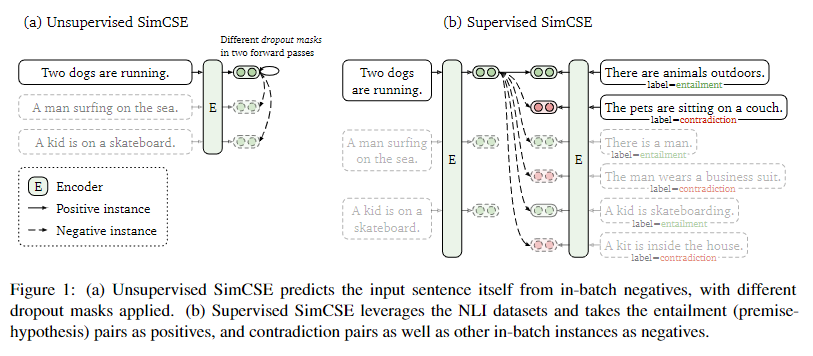

##### 2. Background: Contrastive Learning

&emsp;&emsp;对比学习的目标是拉近语义相似的句子之间的距离, 语义不同的句子之间互相远离. 假设有一个句子集合
$$
\mathcal D = \{(x_i, x_i^+)\}_{i=0}^{m}
$$
其中, $x_i$和$x_i^+$是于一相似的正例句子, batch里的其余句子都是反例. 让$h$代表$x$的向量表示, $h=f_\theta (x)$,为编码函数.
$$
\mathcal l_i = log \frac{e^{sim(h_i, h_i^+)/\tau}}
{\sum_{j=1}^Ne^{sim(h_i,h_j^+)/\tau}}
$$

###### Positive Instance

&emsp;&emsp; [按照Introduction中提到的方式构建数据增强](#jump)

###### Alignment and uniformity

1. *alignment*给定一个正例的分布$p_{pos}$, 对齐计算正例句子对之间的欧氏距离的数学期望. 
  
   
    >正例句子在空间中的位置应该尽可能接近.
   
2. *uniformity*衡量句子嵌入的向量空间是否是均匀分布的.

    > 向量嵌入应该分布在一个超球面上.

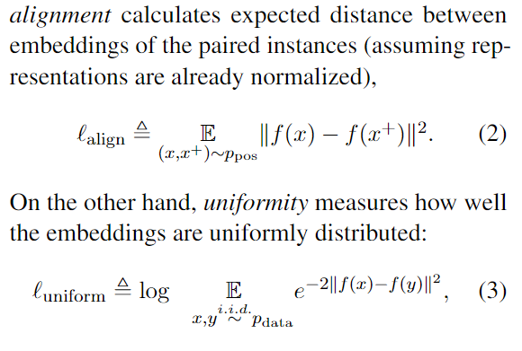

##### 3. Unsupervised SimCSE

&emsp;&emsp; 想法十分简单, 使用同一个句子两次送入独立的dropout, 得到两个不同的句子作为正例.

$h_i^z = f_\theta(x_i, z)$, 其中中$z$代表dropout mask. 
$$
\mathcal l_i = log \frac{e^{sim(h_i^{z_i}, h_i^{z_i^{\prime}})/\tau}}
{\sum_{j=1}^Ne^{sim(h_i^{z_i}, h_j^{z_j^{\prime}})/\tau}}
$$

&emsp;&emsp; 使用N=512(batch_size)以及m=$10^6$ 个从Wiki中随机采样的无监督句子. 本文尝试了不同dropout下模型的表现, 如下图.

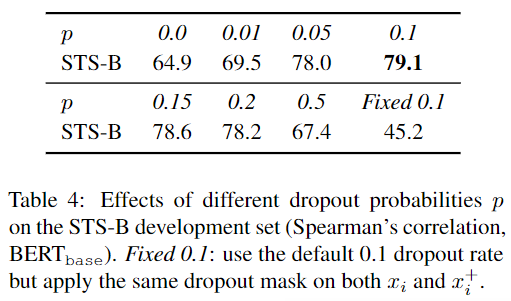

&emsp;&emsp;每10个step记录模型的*uniformity*和*alignment*, 如下图. 

> We take STS-B pairs with a score higher than 4 as $p_{pos}$ and all STS-B sentences as $p_{data}$

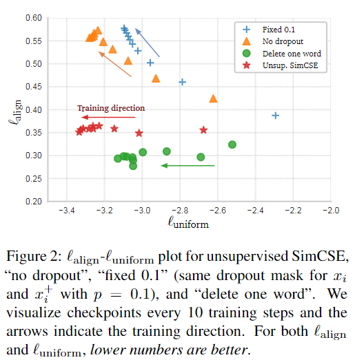

##### 4. Supervised SimCSE

&emsp;&emsp; 不是使用dropout, 而是使用NLI有监督数据集来构造正例和反例. 让正例的优化上述无监督的目标. 除了NLI数据集, 本文也探究了几个其他数据集, 发现NLI数据集的效果最好, 并且在NLI数据集中添加hard negative后, 会进一步提高模型的表现.

###### Hard Negative

&emsp;&emsp; 使用contradiction数据构建hard negative, 他们相较于普通的非正例反例更加难以区分, 因此能够提升模型的表现. 这样将$(x_i, x_i^+)$拓展到了$(x_i, x_i^+, x_i-)$, 训练目标在原有基础上加入了反例.
$$
\mathcal l_i = log \frac{e^{sim(h_i, h_i^{+})/\tau}}
{\sum_{j=1}^N
(e^{sim(h_i, h_j^{+})/\tau}
+ e^{sim(h_i, h_j^-) / \tau})
}
$$
> 观察这两个训练目标可以发现, 真实数据只和数据增强后的数据进行比较; 真实数据之间不进行比较.

##### 5. Connection to Anisotropy

&emsp;&emsp; 研究发现, 学习到的向量嵌入空间分布在狭窄的圆锥体中, 而不是理想的超球面上. 这种现象被称为表征退化, 单词嵌入矩阵的奇异值急剧下降, 除了少数较大的奇异值以外, 其余奇异值都接近于零. 一种简单的应对这种问题的方法是, 要么消除主成分, 或者将向量嵌入映射到各向同性的空间中 ,也可以在训练过程中加入正则化项. 本文证明对比学习的目标可以让向量空间变得均匀.(数学推导看不懂)

##### 6. Experiment

##### 6.1 Evaluation Setup

&emsp;&emsp; 在7个标准STS数据集上进行评测. 并且将STS任务作为句子嵌入任务的主要评估指标. 此外, 也在其它任务上进行列并测, 包括MR, CR, SUBJ, MPQA, SST-2, TREC, MRPC上进行了测试. 将句子嵌入固定住, 接入一个全连接层.(没有对句子嵌入进行fine-tune) . 

###### Training Details

&emsp;&emsp; 在预训练模型上的[CLS]加入MLP进行训练. 在训练过程中, 加入了MLM目标作为辅助训练. 再添加了MLM训练目标后, 模型在非STS任务上的表现有所提高.

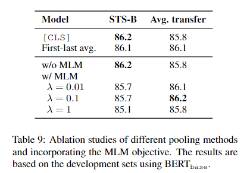

##### 6.2 Main Results

&emsp;&emsp; 本文对比了多种句子嵌入方法, 包括无监督, 不基于预训练的, 基于与训练的多种方法.

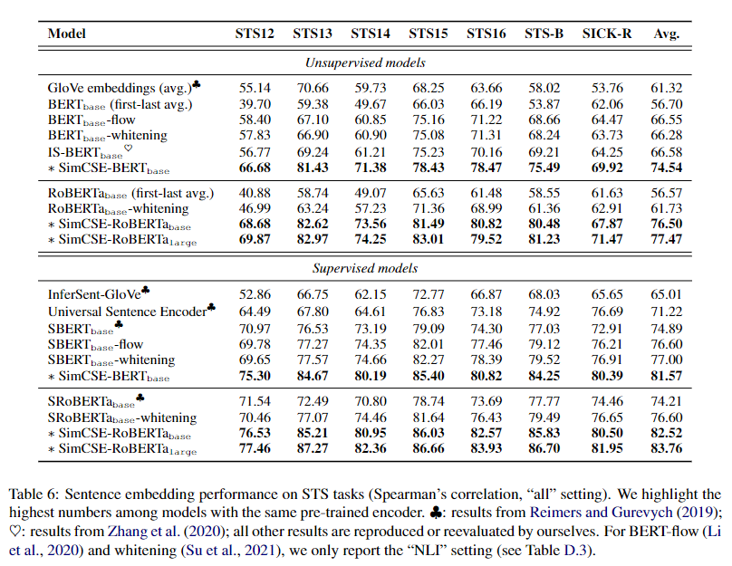

##### 6.3 Ablation Study
&emsp;&emsp; 探究了不同的batchsize, pooling method以及额外训练目标对模型性能的影响. 所有的消融实验都是基于有监督SimCSE, 在STS-benchmark或transfer tasks的dev set上评估得到的结果.
1. Batch size: 提高batch size会提高模型性能, 但当到达一定成都后便不再提升.

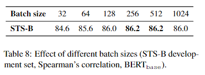
2. Pooling: SBert中提及, 使用mean pooling效果要优于[CLS], 但使用本文的方法并不能在这两种池化方法中找到明显的区别, 为了方便, 使用[CLS].

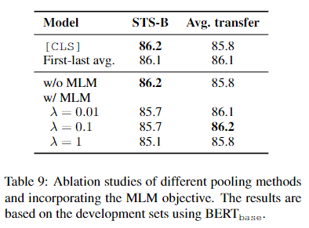
3. MLM objective: 使用MLM目标不会提高STS任务的表现,但是会提高transfer任务的表现, 如上图所示.

##### 7. Analysis

##### Uniformity and alignment

&emsp;&emsp;下图展示了不同嵌入方法的STS平均表现以及对齐度和均匀度. 如果仅从这个图的结果来分析, 可以得出当align和uniform都小时, 可以得到优异的结果, 而SimCSE恰好满足这两点. 

- 尽管未经处理的预训练模型的embedding满足对齐, 但是他们的均匀性很差, 收到各向异性的困扰.
- 后处理方法, 例如flow和whiting很好的解决了均匀性问题(毕竟他们的提出就是为了解决各向异性的问题), 但是他们的align明显下降, 出现了退化的问题.
- unsup SimCSE同时提高了均匀性和对齐性, 并且在引入了有监督训练数据之后, 提升更加明显.

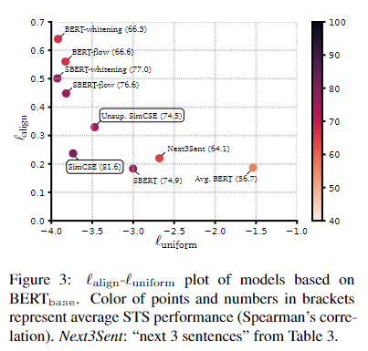

###### Cos-sim distribution

&emsp;&emsp; 为了直接探究本文方法在STS任务中的效果, 直接将STS-B数据集中人类打分和模型评估的相似度绘制出来.从如中可以观察到, 未处理的BERT的相似度分布十分集中, 而SimCSE等处理后的相似度分布变得更加分散. (不过SimCSE和其他处理方法之间并没有明显的差距)

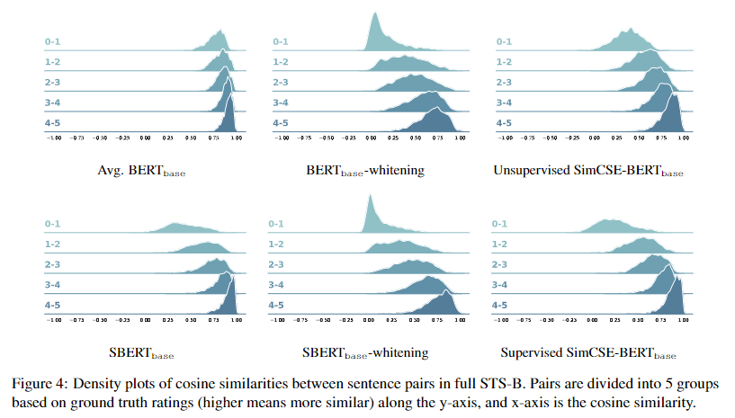

##### 9. Conclusion
&emsp;&emsp; 提出了SimCSE, 将对比学习应用到句子嵌入, 在STS任务上的表现的到了明显的提高. 无监督方法只使用了最小程度的数据增强dropout就取得了十分显著的成效.  
> 本文的无监督目标, 使用dropout作为数据增强是文章最大的亮点.

##### Appendix
##### A Training Details
&emsp;&emsp; 使用Huggingface的预训练模型. 对于**监督训练**, 使用512 batchsize, tem = 0.05, Adam. 对于base模型, lr = 5e-5; 对于large模型, lr=1e-5, 每250个training step对模型在sts-b的dev上进行评估, 保存最好的checkpoint. 对于**无监督训练**, 只训练一个epoch, 并且对base和large模型都采用5e-5的学习率.
&emsp;&emsp; **无监督训练**数据集为英文问及百科, 100万条数据. **有监督训练**数据集为SNLI+MNLI.

##### B Different STS Evalutaion Setting
&emsp;&emsp; 就以下三个方面存在的变数来对STS任务进行评估
1. Additional regressors: 默认的SentEval实现在冻结后的句子嵌入曾上加上一个线性回归, 但大多数文章直接使用raw embedding来对巨资进行评估. 在本文的实验, <u>*不添加额外的线性回归, 直接使用原始的句子嵌入进行评估*.</u>
2. Metrics: 评估指标有pearson和spearman, 在本文的实验中, 使用<u>*spearman rank correlation*</u>
3. Aggregation methods: STS任务发布时是按照不同主题进行发布的, 主要的结果聚合方法有三种, 除非特别声明, 本文使用<b>*all*</b>.
   1. *all*: 将所有主题的数据合并在一起进行评估.
   2. *mean*: 将每个主题的数据单独评估, 之后将他们的指标平均.
   3. weighted-mean: 将每个主题的数据单独评估, 将他们按照数据的数量进行加权平均.

##### D More Ablation

1. 温度超参数对性能的影响. 温度超参在0.05时最佳, 并且余弦相似度比内积表现更好.

   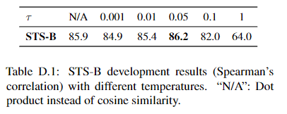
   
2. Hard Negative对性能的影响.

   &emsp; &emsp; 直接使用in-batch neg和hard neg是有区别的, 一个代表"非正例", 另一个代表"真反例 / 假反例"(真反例代表自己的反例, 假反例代表in-batch内其他句子的反例, 此处的反例均为contradiction, 即hard negative). 如果将一个句子的反例给另一个句子当作"真反例", 这样会出现错误. 因此改写了有监督的训练目标, **当且仅当遇到真反例时, 才将其纳入损失**.  同时也测试了将中性分类加入反例, 这样会降低表现. 实验结果如下, 其中$\alpha=1.0$为上文所使用的设置.
   $$
   \mathcal l_i = log \frac{e^{sim(h_i, h_i^{+})/\tau}}
   {\sum_{j=1}^N
   (e^{sim(h_i, h_j^{+})/\tau}
   + \alpha^{\mathbb 1_i^j} e^{sim(h_i, h_j^-) / \tau})
   }
   $$
   

   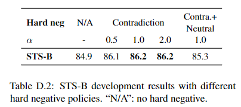

##### E Distribution of Singular Value

&emsp;&emsp; 绘制了奇异值的分布情况, 可以发现, 没有经过处理的BERT奇异值分布非常不均匀, 而经过处理后, 奇异值分布开始变得均匀, 并且使用whiting, flow这些目的是让分布各向同性的方法时, 奇异值分布会更加均衡.

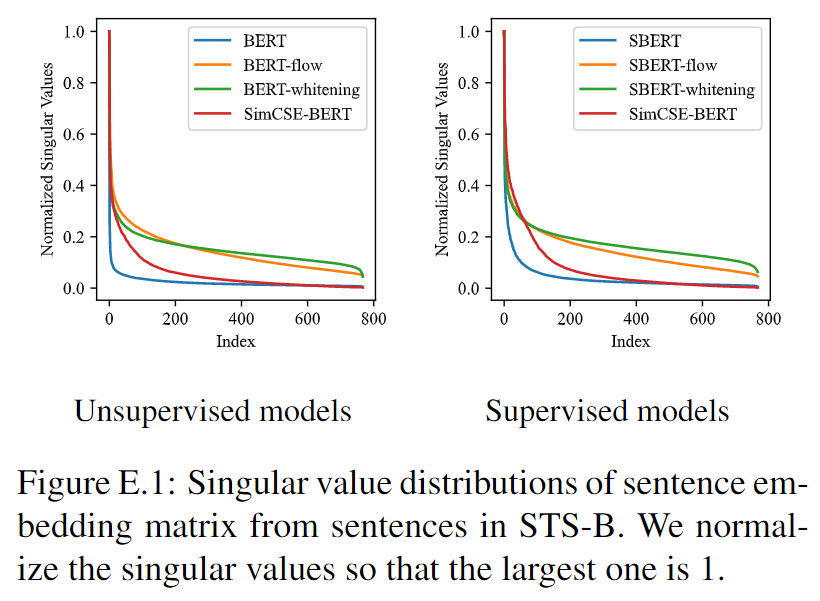

[W]: https://ssnl.github.io/hypersphere/

