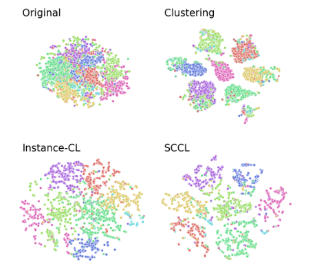

### 对比学习, 据类
#### Supporting Clustering with Contrastive Learning - Amazon AI, Columbia University
##### Abstract
&emsp;&emsp; 无监督聚类的目的是根据向量表示空间之中的距离来发现类别信息. 但是在学习开始过程中, 不同类别在向量表示空间中通常存在相互重叠的问题, 对于基于距离的据类方法产生挑战. 为此, 本文提出了**Supporting Clustering with Contrastive Learning (SCCL)**, 使用对比学习来辅助据类. 
##### 1. Introduction
&emsp;&emsp; 聚类是一种经典, 基础的无监督问题. 早期方法例如K-means, 高斯混合模型都是依赖于数据控件中的距离作为衡量, 往往对高纬度数据效果差. 另一方面, 使用神经网络将数据映射到低维度,  希望能够更好的将数据在空间中分开. 
&emsp;&emsp; 许多最近的研究聚焦于使用**深度表征学习**, 在向量空间中进行聚类. 尽管相对于传统方法提高了表现, 但是在面临具有大量类别的复杂数据时, 他们仍然不优秀, 具体表现为, 不同类别之间仍然存在重叠, **作者认为, 通过优化基于距离, 相似度目标得到的据类承受低纯度的影响, 即不同类之间存在着重叠**. 另一方面, 实例间的对比学习最近在自监督领域很火, 实例对比学习通常在数据增强获取的一个辅助数据集合上进行优化, 众所周知, 对比学习可以拉近相似样本的距离, 远离不相似样本, **作者希望通过对比学习的性质来改善据聚类中不同类别的重叠问题**.

&emsp;&emsp; 作者提出了SCCL, 通过**联合优化自顶向下的聚类损失以及自底向上的实例对比损失**. 本文的Contributions如下

1. 提出了对比学习无监督据类框架
2. 分析SCCL是如何取得更好地结果的.
3. 探索不同的数据增强手段, 不同于CV, 在NLP中数据增强不一定是有效的.

##### 2. Related Work
1. 自监督学习: 自监督学习为下游任务提供搞笑的向量表征发面表现优异. 早期自监督学习目标通常是针对特定领域量身定制的, 泛化性差. 常见的任务有:MLM(BERT), LM(GPT), denoising(BART). 近期的研究大多是基于对比学习的, 根据对比学习的性质, 可以保持类内局部不变的基础上, 让不同类之间的距离拉远. 但是, 对学习会隐式的将实例进行分组, 只要不在一个分组中, 对比学习就会将这两个实例之间的距离拉远, 尽管这两个实例可能十分相近. 因此又是使用对比学习会让句子表征的能力更差劲.
2. 短文本聚类: 与通常的文本聚类不同, 段文本聚类存在每个实例的信息不足这个问题, 在短文本的场景下, BagofWord, TF-IDF会产生十分稀疏的向量表示, 缺乏表示能力, 为了弥补, 通常使用神经网络来丰富短文本的表征. 

##### 3. Model
&emsp

