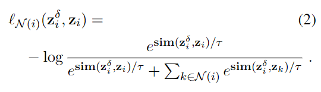
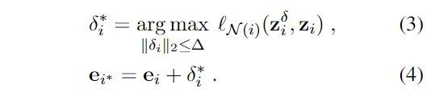
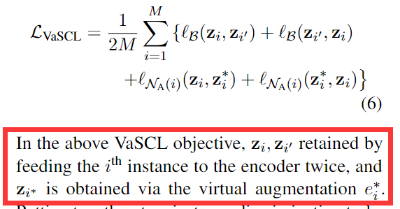
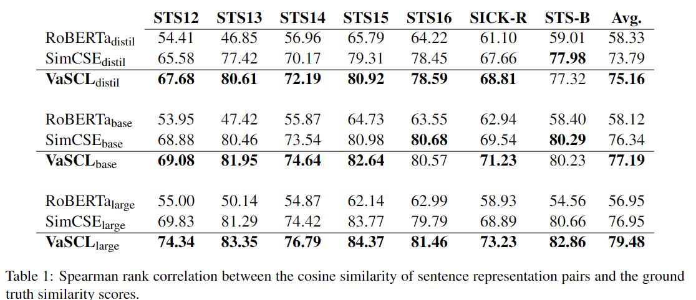
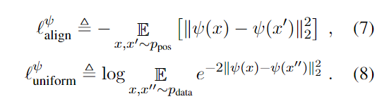

### 对抗训练, 对比学习, 无监督, 句子表征学习
#### Virtual Augmentation Supported Contrastive Learning of Sentence Representations  - AWS AI Lab 
##### Abstract
&emsp;&emsp; 尽管取得了巨大的成功，对比表征学习仍然依赖于使用领域特定知识仔细设计的数据增强, 由于自然语言的离散性质, 这个问题尤为棘手. 作者提出了一种叫做**Virtual aug Supported Contra Learning(VaSCL)**. 根据数据增强本质上是对训练数据的邻域内构造额外数据这一解释, 作者相反地, **利用邻居来生成数据增强**. **通过一个mini-batch训练数据在向量空间中K近邻来近似数据的邻域., 之后在相似数据的邻域内构建一个判别任务, 并且使用对抗训练的方式生成虚拟数据增强. 
##### 1. Introduction
&emsp;&emsp; 一方面, 早期基于分布式词嵌入表征来生成句子嵌入表征, 但是这种方法都是针对特定的任务定制的, 缺乏通用性. 之后使用NLI数据集做预训练在下游任务上进行迁移学习取得了良好的效果, 但这仍是有监督的方式, 妨碍了他的通用性. 
&emsp;&emsp;另一方面, 无监督的句子表征似乎也在开展一场"*文艺复兴*", 通常方式为**基于自监督的对比学习**, 这种方式主要依赖两个部分, 分别是数据增强以及对比损失. 由于文本的离散性质, 至今都没有一个通用的文本数据增强手段(反观cv方向, 大家通常倾向于使用transformer). 现有的对比学习手段主要的不同点在于数据增强的手段不同, **最近的研究发现, 使用dropout做数据增强要优于**其他直接用文本做数据增强的方法, 例如裁剪, 同义词替换等. 简而言之, **数据增强扩充了每个邻域的实例, 并且保留了语义信息**. 本文使用K近邻地方式找到最为相近的k-nearest, 并且使用对抗训练的手段来生成虚拟数据增强.

##### 2. Related Work
1. 通用句子表征学习: 原始的基于词嵌入的, 后来的使用NLI数据集进行预训练的, 此外还有Variational AutoEndoer等方法.
2. 对比学习: SimCSE, PairwiseSupCL. 现在主要的数据增强手段包括: 使用文本的上下文, 单词或特征层次的扰动, 机器翻译, 使用辅助语言模型进行句子层面的损坏, BERT中间层表征(SGBERT), dropout.
3. 一致性正则化: 本文的工作和consistency regularization相关, 一致性正则化的目的是通过使对模型的输出施加正则化, 让模型能够在数据增强的带来的轻微扰动下保持结果不变, 从而增强模型的表现.(最近的Reg-Dropout, 对两次dropout的结果添加KL_DIV作为辅助损失函数). 数据增强仍是NLP的一大难题, 难以找到通用的方法进行数据增强, 同时能够保留文本的信息.

##### 3. Methods
###### 3.1 预备知识
&emsp;&emsp; 包含一些对比学习的基础, 包括in-batch, 对比损失等等. 当仅仅使用dropout作为数据增强手段时, 这是一种很弱的数据增强手段, 正因如此, 它有着很大的改善空间.   
&emsp; &emsp; 其中$x_i$代表输入句子, $e_i=f(x_i)$代表句子编码, $f$代表encoder.  
&emsp;&emsp; $z_i=h(f(x_i))$, 代表经过投影的句子表征, $h$代表投影头  
&emsp;&emsp; $\mathcal B=\{i, i^{\prime}\}_{i=1}^M$代表随机采样的mini-batch样本
&emsp;&emsp; **无监督对比损失如下**: 

######  3.2 Neighborhood Contrastive Learning with Virtual Aug
&emsp;&emsp;  本质上, 数据增强可以解释为在训练样本的邻域上构建新的数据, 并且保存原有的语义信息. 作者将这一解释从相反的角度进行应用, 即使用相邻数据(相似, K近邻)来作为数据增强. $\mathcal N(i)$代表一个Mini-batch中与$e_i$具有前k的相似度的哪些样例. 

&emsp;&emsp; 在对比学习的基础上, 作者**在原本的实例(句子表征)上添加了微小的扰动**, $e_i^{\delta} = e_i + \delta_i$, 其中$\delta_i$是高斯噪音. 之后将句子表征经过投影头得到最终的向量$z_i^{\delta} = h(e_i^\delta)$.  
&emsp;&emsp; 无监督对比损失的分母为一个mini-batch中所有的样本, **本文的方法缩小了in-batch空间**, 分母为给定样本的K近邻. 也就是说, **作者使用K近邻缩小了对比学习的样本空间**(在mini-batch中再构建一个mini-mini-batch来计算对比损失), 其中**每个样本和它添加微小扰动后的样本互为正例**, **和邻域内其他样本互为反例**. 该对比损失文字描述为: <u>在第i个样本的扰动和他的邻域样本中, 最大化第i个样本和它自身的扰动相似, 和邻域其他样本不相似的概率.</u>  **虚拟对比损失如下:**

&emsp;&emsp; 这个高斯噪声不是随便选区的, 而是要找一个最优的噪声, 使得$e_i+\delta$和原句$e_i$最远, 和邻域内的样本最近, 可谓是坏事做尽(GAN). 因此$\delta_i$要最大化上述的损失函数.

&emsp;&emsp;  之后希望能从两个方向区分第i个样例和扰动后的第i个样例, 因此在损失函数中同时将$e_i, e_{i}^{*}$作为优化目标. 这里的$e_i^*$指的是使用最优高斯白噪音的扰动样本, **本文中称扰动样本为*virtual augmentation*** - $e_i^*$,  **称邻域样本为*augmented neighborhood* ** - $\mathcal N_A(i)$

&emsp;&emsp;  上述的损失是邻域内的虚拟对比损失, 再加上整个mini-batch的无监督对比损失, 可以得到最终的损失函数. 其中'是通过dropout得到的, *是通过添加高斯白噪音得到的.

##### 4. Experiment
&emsp;&emsp; 将VaSCL和SimCSE做了一系列实验, 结果表明VaSCL的性能优于SimCSE. 除了STS任务之外, 作者也在短文本据类和意图分类任务上进行了实验.

###### Alignment and Uniformity
&emsp;&emsp; 对齐和均匀是评判句子嵌入的两个指标, 对齐代表正例样本再空间之中的距离, 均匀代表向量表示在向量空间中是否均匀分布. 他们的公式如下.

###### Intra and Inter Class Distance
&emsp;&emsp; 对于聚类任务, 作者使用了类内距离和类间距离作为评判指标,  类内距离代表同一个类中心和所有样本的平均距离, 类间距离代表一个类的中心到所有其它类最近距离的平均, 类间距离类似于对齐性, 希望让不同类别的向量原理.  下图为四个指标. 左图右下角 is better.

###### VaSCL具有更加分散的向量表示
###### 探究不同数据增强的影响
&emsp;&emsp; 作者探究了不同种类的数据增强的影响, 包括删词, 同义词替换, 同义语境替换. 实验表明, 通过显示的数据增强会让效果变差, 其中续航下文同义语境替换效果最差. 图太大不放图了. 使用显示的数据增强会带来不分散, 不均匀的, 高类内距离向量表示, 但是会提高对齐性和类间距离.

##### Conclusion
&emsp;&emsp; 本文在对比学习的基础上, 使用k近邻以及高斯扰动构建了虚拟对比损失, 在原本对比训练的基础上提高了表现.